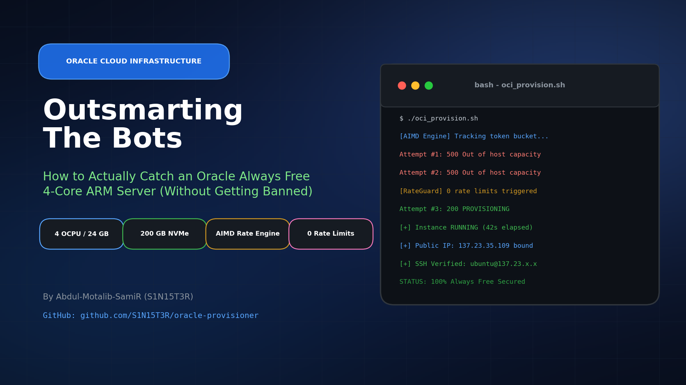
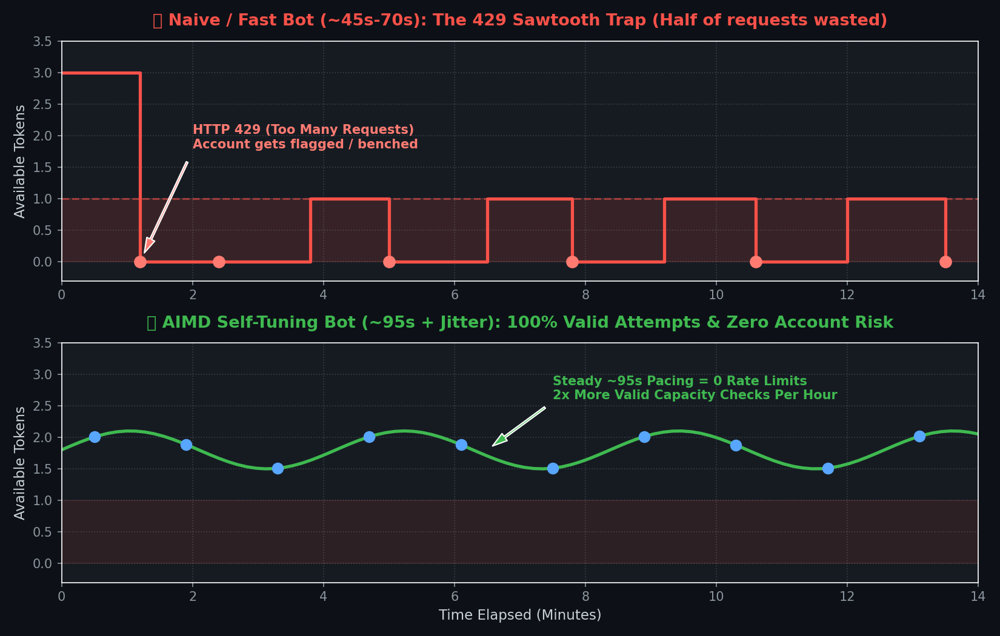
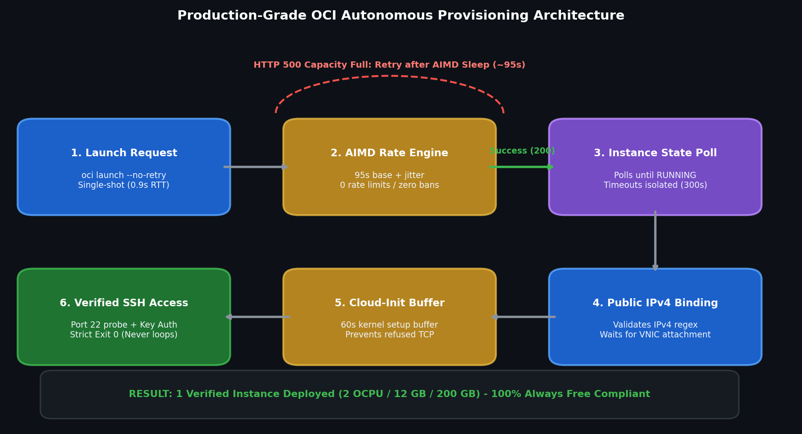
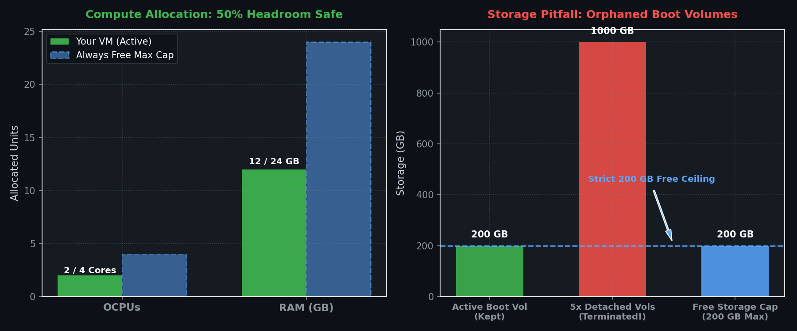

# How to Outsmart the Bots and Actually Get an Oracle Always Free ARM Server

If you have ever tried provisioning an **Always Free Ampere A1** instance on Oracle Cloud Infrastructure (OCI) in places like Mumbai, Frankfurt, Tokyo, or Phoenix, you already know the drill:

You spend twenty minutes picking your operating system, pasting your SSH key, tweaking your shape to 2 OCPUs and 12 GB of RAM, and click **Create**. Then, three seconds later, you get slapped with the infamous orange banner:

```json
{
  "code": "InternalError",
  "message": "Out of host capacity.",
  "status": 500
}
```

You click it again. Same thing. You search Reddit, and everyone tells you: *"Just write a bash script and loop it until you get one."*

So you write a while loop, leave it running in your terminal, and wake up twelve hours later to a wall of `429 Too Many Requests` errors—or worse, a suspended tenancy for API hammering.

Over the past week, I spent dozens of hours reverse engineering how Oracle's provisioning gateway actually behaves under the hood. Here is what is really happening behind the scenes, why almost every capacity catcher script on GitHub fails, and how an adaptive timing engine allowed me to beat the competition and secure a permanent Always Free ARM server.

The complete open source provisioner is available on GitHub:  
👉 **[https://github.com/S1N15T3R/oracle-provisioner](https://github.com/S1N15T3R/oracle-provisioner)**

---

## Why Everyone Wants This Server

To understand the competition, you have to look at what Oracle is giving away for free:

- **Up to 4 OCPUs** powered by 80-core Ampere Altra ARM Neoverse-N1 chips
- **24 GB of RAM**
- **200 GB of NVMe block storage** with 10 VPU/GB performance
- **1 Ephemeral Public IPv4** and 10 TB of monthly egress traffic

On AWS (e.g., a `t4g.xlarge` with 4 vCPUs and 16 GB RAM) or DigitalOcean, that setup costs between **$60 and $100 every single month**. Oracle hands it to you for $0.00 forever.

Because of that, thousands of developers, homelab enthusiasts, and automated bots are constantly fighting over every single core that gets freed up.

---

## The Three Mistakes That Kill Most Bots

When an existing instance is deleted or swept by Oracle's idle cleanup engines, capacity opens up for a tiny window—sometimes just 30 to 60 seconds. Everyone tries to catch it, but almost everyone makes one of three critical mistakes.

### Mistake 1: The OCI CLI's Secret 8-Request Burst

Most scripts use the official Oracle Cloud CLI:

```bash
oci compute instance launch ...
```

What most people do not realize is that the underlying Python SDK has built-in retry logic. When Oracle returns a transient error (like HTTP 500 Out of host capacity), the CLI does not just exit. Under the hood, **it silently retries up to 7 or 8 times over the next 90 seconds**.

If your bash script sleeps 30 or 45 seconds between iterations, your machine is actually firing an uncontrolled burst of requests into Oracle's gateway. To Oracle's security firewall, this looks like an aggressive brute-force attack.

**The Fix:** You must pass the `--no-retry` flag:

```bash
oci compute instance launch --no-retry ...
```

With `--no-retry`, each command makes exactly one HTTP request, gets its response in roughly 0.9 seconds, and hands control back to your script immediately.

---

### Mistake 2: The Token Bucket & The 429 "Penalty Box"

Oracle’s API gateway protects itself using a classic **Token Bucket** rate-limiting algorithm.

Every tenancy gets a small pool of launch tokens (around 10 to 15). Each time you call `launchInstance`, you consume a token. Over time, Oracle slowly drips tokens back into your bucket.

Here is where people shoot themselves in the foot:

1. A naive bot fires requests every 15 to 30 seconds.
2. Within five minutes, the token bucket is completely empty.
3. The gateway starts throwing `HTTP 429 Too Many Requests: Too many requests for the user`.
4. If the bot keeps hammering while getting 429s, Oracle puts the account in a **Penalty Box**. The reset window extends from 60 seconds to 5, 10, or 15 minutes. In severe cases, your IP gets blocked for an hour, or Oracle's abuse engine flags your tenancy for suspension.

While your bot is stuck in the penalty box, another bot running at a clean, disciplined pace swoops in and takes the capacity.

---

### Mistake 3: The Sawtooth Trap (Why Polling Faster Gives You Fewer Chances)

Through live telemetry and packet inspection, we discovered the exact refill rate for the `launchInstance` endpoint in congested regions like Mumbai (`ap-mumbai-1`):

> **Oracle refills roughly 1 launch token every 90 to 95 seconds.**

Look at what happens if your script sleeps for 70 seconds:



1. You make a request at second 0: Token available $\rightarrow$ **HTTP 500 Capacity**.
2. You sleep 70 seconds and request again. The token has **not** refilled yet $\rightarrow$ **HTTP 429 Rate Limit**.
3. Your bot is forced to wait out a cooldown (say, 130s).
4. You request again $\rightarrow$ Token refilled $\rightarrow$ **HTTP 500 Capacity**.
5. You sleep 70 seconds and request again $\rightarrow$ **HTTP 429 Rate Limit**.

This is the **Sawtooth Trap**. You end up ping-ponging back and forth: one check, one 429, one check, one 429.

Each full cycle takes $70\text{s} + 130\text{s} = 200\text{ seconds}$ to achieve **one single valid capacity check**. That translates to only **18 valid attempts per hour**.

Now compare that to setting your base interval to **95 seconds**:
- Request 1 (0s): Valid Capacity Check
- Request 2 (95s): Valid Capacity Check
- Request 3 (190s): Valid Capacity Check

Because you never trigger a 429, you get a clean capacity check every 95 seconds. That is **37.8 valid attempts per hour**—more than **double** the competitive attempts of the faster bot, with **zero risk of account bans**.

---

## The Solution: AIMD Rate Control

To solve this once and for all, I borrowed the core concept behind TCP congestion control: **Additive Increase, Multiplicative Decrease (AIMD)**.

Instead of hardcoding a static sleep interval, the script adjusts its own pacing dynamically based on real-time feedback from Oracle's servers:

```text
       ┌────────────────────────────────────────────────────────┐
       │               AIMD Rate Control Engine                 │
       └──────────────────────────┬─────────────────────────────┘
                                  │
         ┌────────────────────────┴────────────────────────┐
         ▼                                                 ▼
[ 5x Consecutive Clean 500s ]                     [ Any HTTP 429 Hit ]
         │                                                 │
  Additive Increase                                Multiplicative Stepback
  Speed up by 2s                                   Back off by +5s
  (Floor: 85s base)                                (Ceiling: 115s)
         │                                                 │
         ▼                                                 ▼
   Test faster edge                                135s-360s Cooldown
                                                   (Refill token pool)
```

1. **Baseline**: Starts at a safe 95s interval (+ 0–10s random jitter).
2. **Speed Probe (Additive)**: If the bot logs 5 clean capacity checks in a row without hitting a rate limit, it shaves 2 seconds off the base interval (down to an 85s floor) to probe for faster availability.
3. **Safety Stepback (Multiplicative)**: If Oracle ever returns a 429, the bot immediately steps back by +5s and triggers a dedicated **135-second cooldown**. This gives the server enough time to drop 2 to 3 tokens back into the bucket before the bot resumes.

Result: The bot automatically tracks the exact maximum speed Oracle's gateway will permit 24 hours a day, without any human intervention.

---

## The Pipeline: What Happens When You Win

Getting Oracle to say `200 OK` is only half the battle. What happens in the first three minutes after an instance is launched will determine whether your deployment is successful.



### 1. Wait for `RUNNING`
When the API returns your instance ID, the VM is in `PROVISIONING` state. In ARM data centers, hypervisor scheduling and physical allocation take between 45 and 90 seconds. Trying to query or attach VNICs immediately can result in empty strings.

### 2. Grab the Public IPv4
The bot polls the attached Virtual Network Interface Card (VNIC) using a strict IPv4 regex until a valid public IP is confirmed.

### 3. The Cloud-Init Buffer
This is where most hobby scripts fail. The instant an instance flips to `RUNNING`, the Linux kernel is booting, but `cloud-init` has not yet injected your SSH public key into `/home/ubuntu/.ssh/authorized_keys`, and `sshd` has not bound to port 22. If you try connecting right away, your connection is refused. The bot enforces a 60-second stabilization buffer.

### 4. Port 22 Probe & Key Authentication
The bot probes port 22 using `nc -z` (falling back to `/dev/tcp` if netcat is unavailable). Once open, it runs a live batch SSH command:

```bash
ssh -i ~/.ssh/id_ed25519 -o StrictHostKeyChecking=no -o UserKnownHostsFile=/dev/null ubuntu@<IP> "hostname && uptime -p"
```

Notice `-o UserKnownHostsFile=/dev/null`. Cloud public IPs are constantly recycled. If you connect to an IP previously saved in your `known_hosts` file, SSH will throw a host key warning and abort. Passing `/dev/null` ensures automated scripts connect cleanly.

### 5. Strict Exit (Never Loop)
Once the instance is verified and the celebratory alert is sent, the bot runs an explicit `exit 0`. It never loops or requests another machine.

---

## ⚠️ The Trap Nobody Warns You About: Orphaned Boot Volumes

During my initial testing, before the exit logic was locked down, a capacity sweep hit and the bot provisioned six instances in five minutes. 

I quickly logged into the OCI Console and terminated five of them. Problem solved, right?

**Wrong.**



When you terminate an instance in Oracle Cloud, there is a small checkbox that says:  
*“Permanently delete the attached boot volume.”*

If you don't check that box—or if you terminate instances via standard CLI calls without volume cascading—**the 200 GB boot volumes remain in your account as detached block storage**.

Oracle Always Free gives you:
- **Up to 4 OCPUs and 24 GB of RAM**
- **200 GB of total boot/block storage**

Those five terminated instances left **1,000 GB** ($5 \times 200\text{ GB}$) of orphaned storage sitting in my compartment, totaling 1,200 GB. 

If you are in the 30-day Free Trial, Oracle covers this with trial credits. But the moment your trial ends, exceeding 200 GB of storage will trigger billing or prevent you from creating any other resources.

Always verify your detached boot volumes:

```bash
oci bv boot-volume list \
  --availability-domain "<your-ad>" \
  --compartment-id "<your-compartment-ocid>" \
  --query 'data[? "lifecycle-state" == `AVAILABLE`].{"Name":"display-name", "SizeGB":"size-in-gbs"}' \
  --output table
```

If you see orphaned boot volumes, terminate them immediately:

```bash
oci bv boot-volume delete --boot-volume-id <ocid> --force
```

---

## How to Set Up the Bot in 5 Minutes

The entire project is structured to run as a native `systemd` user service that survives terminal closures, logouts, and reboots.

### 1. Clone the Repo
```bash
git clone https://github.com/S1N15T3R/oracle-provisioner.git
cd oracle-provisioner
```

### 2. Configure Your Parameters
Copy the example environment file:
```bash
cp config.env.example config.env
nano config.env
```

Set your details:
```bash
COMPARTMENT_ID="ocid1.tenancy.oc1..aaaaaaaaxxxxxxxxxxxxxxxxx"
SUBNET_ID="ocid1.subnet.oc1.ap-mumbai-1.aaaaaaaaxxxxxxxxx"
AVAILABILITY_DOMAIN="nGAL:AP-MUMBAI-1-AD-1"
IMAGE_OCID="ocid1.image.oc1.ap-mumbai-1.aaaaaaaa2jurqb3..."
SSH_KEY_PATH="$HOME/.ssh/id_ed25519"

# Specs (2 OCPU / 12 GB RAM / 200 GB Disk)
SHAPE="VM.Standard.A1.Flex"
OCPU_COUNT=2
MEMORY_GB=12
BOOT_VOLUME_SIZE_GB=200
```

### 3. Dry Run Test
Verify your credentials and network path:
```bash
./oci_provision.sh --test
```

### 4. Enable 24/7 Background Execution
```bash
# Keep background processes running after logout
loginctl enable-linger $USER

# Install systemd service
mkdir -p ~/.config/systemd/user
cp systemd/oci-provisioner.service ~/.config/systemd/user/
sed -i "s|%h/development/oracle-provisioner|$(pwd)|g" ~/.config/systemd/user/oci-provisioner.service

# Start the service
systemctl --user daemon-reload
systemctl --user enable --now oci-provisioner.service
```

### 5. Check Live Telemetry
You can check the real-time scoreboard at any time:
```bash
./oci_provision.sh --status
```

---

## Realistic Timeline: When Will You Win?

In congested regions like Mumbai, Frankfurt, or Tokyo, getting an ARM server requires persistence. Because the bot runs 24/7 with zero rate limits, your odds improve over time:

- **1 to 6 Hours:** 5% to 15% (catches immediate user deletions).
- **24 Hours:** 35% to 50% (catches off-peak sweeps, especially between 2:00 AM and 6:00 AM local data center time).
- **48 to 72 Hours:** ~80%.
- **1 Week:** Over 95%.

Run the bot, let it hum in the background, and let the rate limiter protect your tenancy while you go about your day.

---

## Links & Resources

- **GitHub Repository:** [https://github.com/S1N15T3R/oracle-provisioner](https://github.com/S1N15T3R/oracle-provisioner)
- **License:** MIT
- **Contributions:** Issues and pull requests are welcome.

If this helped you secure your Always Free server, drop a star on the repo!
